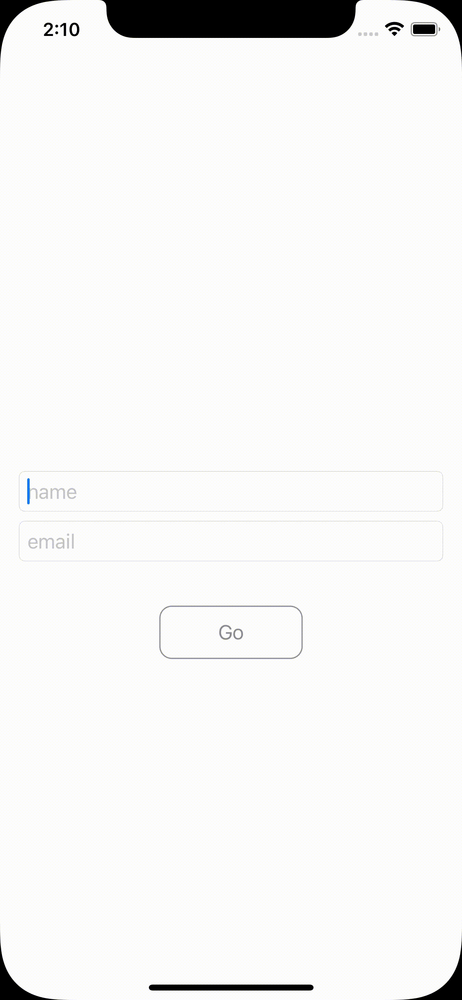
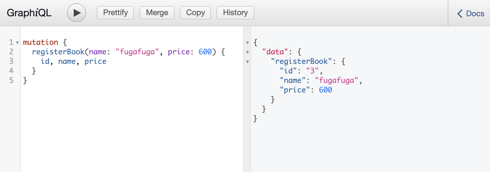
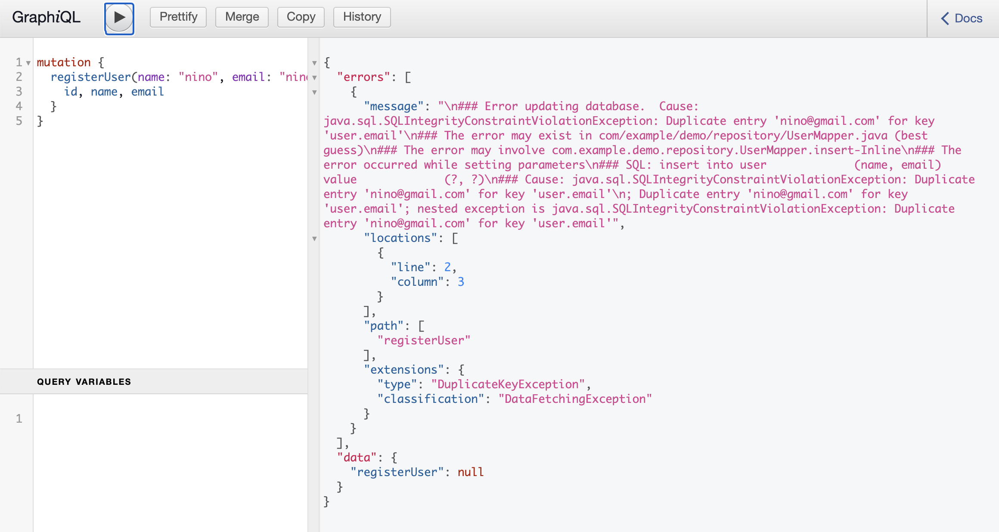
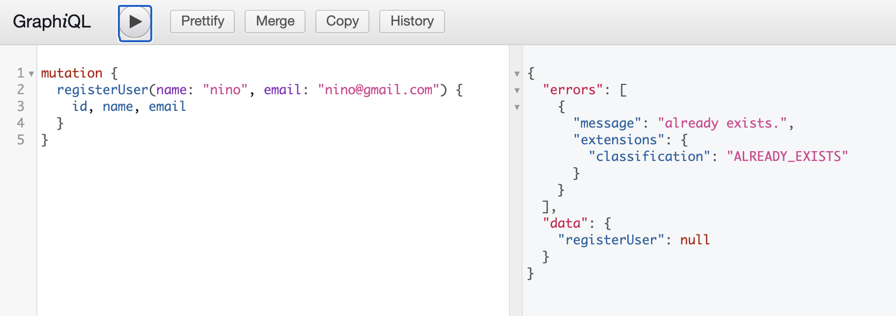

## GraphQL-demo

[GraphQL](https://graphql.org/) is a query language for your API.

It is a demo project using GraphQL API x Spring Boot x Apollo iOS.

features
* register user from app
* fetch book list
* enable user to order book



### GraphQL + Spring Boot
GraphQL in Spring Boot using [Spring Boot GraphQL Starter](https://github.com/graphql-java-kickstart/graphql-spring-boot).<br>
GraphQL also has a tool called GraphiQL that is able to execute queries and mutations.

```
dependencies {
  implementation("com.graphql-java-kickstart:graphql-spring-boot-starter:11.0.0")
  runtimeOnly("com.graphql-java-kickstart:graphiql-spring-boot-starter:11.0.0")
}
```

### GraphQL Schemas
The GraphQL server need to define a schema ​to describe the API.

We need to create .graphqls file in `src/main/resources/graphql/` directory.

```
type User {
    id: ID!
    name: String!
    email: String!
}

type Book {
    id: ID!
    name: String!
    price: Int!
}

type PreOrder {
    id: ID!
    user_id: ID!
    book_id: ID!
}

type Query {
    getUser(id:ID!): User
    getAllUser: [User]!
    getBook(id:ID!): Book
    getAllBook: [Book]!
    getPreOrderedBooks(userId: ID!): [Book]!
    getApplicants(bookId: ID!): [User]!
}

type Mutation {
    registerUser(name: String!, email: String!): User
    registerBook(name: String!, price: Int!): Book
    preOrder(userId: ID!, bookId: ID!): PreOrder
}
```

### Types & Resolver
[Resolvers and Data Classes](https://www.graphql-java-kickstart.com/tools/schema-definition/#resolvers-and-data-classes)

GraphQL Java Tools will expected to be given data classes that map to the GraphQL types.

GraphQL Java Tools provides `Resolver` that attempts to map fields to methods on the resolver before mapping them to fields or methods on the data class.

#### Types
```
data class Book(
        val id: Long,
        val name: String,
        val price: Int
)
```

#### Resolver
```
@Component
class BookMutationResolver(private val mapper: BookMapper): GraphQLMutationResolver {
    fun registerBook(name: String, price: Int): Book {
        val entity = BookEntity(name = name, price = price)
        mapper.insert(entity)
        return Book(entity.id!!, name, price)
    }
}

@Component
class BookQueryResolver(private val mapper: BookMapper): GraphQLQueryResolver {
    fun getBook(id: Long): Book {
        return mapper.select(id) ?: throw NotFoundException()
    }

    fun getAllBook(): List<Book> {
        return mapper.selectAll()
    }
}
```

#### Run
Access to http://localhost:8080/graphiql.<br>
We can try API here.



※ Unfortunately It is not possible to get all fields without writing all. GraphQL requires you to be explicit about specifying which fields you would like returned from your query. (
[How to query all the GraphQL type fields without writing a long query?](https://stackoverflow.com/questions/34199982/how-to-query-all-the-graphql-type-fields-without-writing-a-long-query) )

#### ExceptionHandler
It is able to use `@ExceptionHandler` annotation for custom GraphQLErrors when `graphql.servlet.exception-handlers-enabled` is `true` link this.
```
@Component
class DemoAppExceptionHandler {
    @ExceptionHandler(Throwable::class)
    fun handleSomeException(e: Throwable): GraphQLError {
        return GenericGraphQLError(e.message)
    }
}
```
※ It is need to specify Exception class to `@ExceptionHandler` annotation.
If not specified, the method annotated @ExceptionHandler is not be called.

By default, the exception name and message are displayed in error response as below.


It is able to display any text into message, location and classification by customizing GraphQLErrors.



### iOS Client
#### apollo
[Apollo](https://www.apollographql.com/) is one of the GraphQL client library.

#### Prepare to use GraphQL API with Apollo

##### schema.json
Apollo iOS requires a GraphQL schema file as input to the code generation process. A schema file is a JSON file that contains the results of an introspection query. Conventionally this file is called `schema.json`.<br>
We can use the [Apollo CLI](https://www.apollographql.com/docs/devtools/cli/) or [Gradle plugin](https://mvnrepository.com/artifact/com.apollographql.apollo/apollo-runtime) to download a GraphQL schema.
After downloading the file, add it into `${SRCROOT}/${TARGET_NAME}` directory as following..
```
app
|-- demo
|   |-- ContentView.swift
|   |-- Info.plist
|   |-- Preview Content
|   |-- demoApp.swift
|   +-- schema.json <- here!!
|
+-- demo.xcodepro
```

* [To use Apollo CLI](https://www.apollographql.com/docs/ios/downloading-schema/)
* [To use Gradle plugin](https://www.apollographql.com/docs/android/essentials/get-started-java/)

In this project, I'm using apollo-runtime. And downloaded file by following command.
```
./gradlew downloadApolloSchema \                                                                                                                                                             [master ~/work/springboot/GraphQL-demo/server]
  --endpoint="http://localhost:8080/graphql/endpoint" \
  --schema="../app/demo/schema.json"
```

##### .graphql
Apollo iOS will generate code from queries and mutations contained in `.graphql` files like this.<br>
We need to create .graphql files and add to target.

```
query Applicants($bookId: ID!) {
  getApplicants(bookId: $bookId) {
    id,name,email
  }
}

mutation User($name: String!, $email: String!) {
  registerUser(name: $name, email: $email) {
    id, name
  }
}
```

##### Installation

It is easy to install framework and generate API file.<br>
There are detail procedure in following link.

https://www.apollographql.com/docs/ios/installation/

> 1. Install the Apollo framework into your project and link it to your application target
2. Add a schema file to your target directory
3. (optional) Install the Xcode add-ons to get syntax highlighting for your .graphql files
4. Create .graphql files with your queries or mutations and add them to your target
5. Add a code generation build step to your target
6. Build your target
7. Add the generated API file to your target

After generate code following guide above, we can call GraphQL API in iOS client like this.

```
private var apolloClient = ApolloClient(url: URL(string: "http://demo.com/graphql")!)
```
```
apolloClient.fetch(query: request.operation) { result in
  switch result {
    case let .success(result):

    case let .failure(error):

  }
}
```
※ We have to ensure that ApolloClient is retained.
If it is not owned, it is deallocated shortly after it goes out of scope, and API request cancelled.
